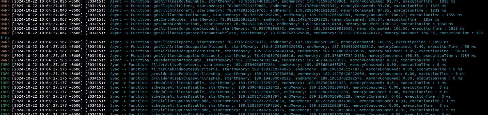

# Memory Profiler for NestJS

This package provides decorators to profile memory usage for both synchronous and asynchronous methods in NestJS applications.

## Installation

To install this package, run:

```bash
npm install @mahabub-arafat/memory-profiler
```

Then import by doing this : 
```JS
import { ProfileAllMethods, ProfileMemorySyncFunction, ProfileMemoryAsyncFunction } from '@mahabub-arafat/memory-profiler';
```

Add then edit the key in your .env file : 
```
ENABLE_MEMORY_PROFILING_DECORATOR=true
```

Usage : 
```JS
@Injectable()
@ProfileAllMethods()
export class FlightSearchService {}
```

Example Outcome: 
